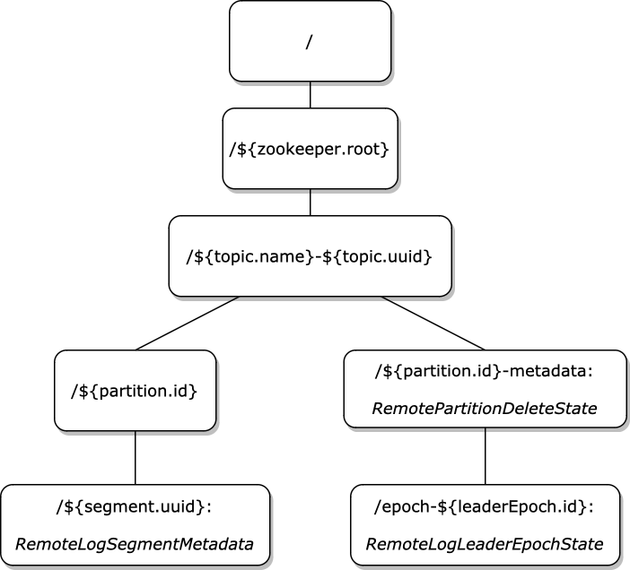
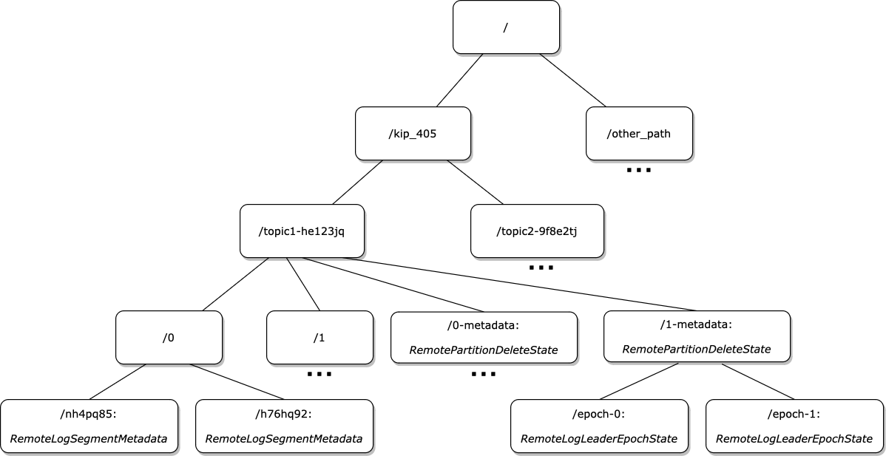

# Zookeeper remote metadata storage backend

Zookeeper `MetadataStorageBackend` implementation. 

### Metadata layout

Example: 

### Configuration

| Name                                                                    | Type   | Default value | Description                                                                                                                                                                                                                        |
|-------------------------------------------------------------------------|--------|---------------|------------------------------------------------------------------------------------------------------------------------------------------------------------------------------------------------------------------------------------|
| `rlmm.config.metadata.storage.zookeeper.host`                           | String | -             | Zookeeper connection string, a comma separated list of host:port pairs, each corresponding to a ZooKeeper server                                                                                                                   |
| `rlmm.config.metadata.storage.zookeeper.root`                           | String | /             | The base znode path relative to which all uploaded keys will be resolved                                                                                                                                                           |
| `rlmm.config.metadata.storage.zookeeper.config.path`                    | String | -             | Absolute path of zookeeper client configuration file                                                                                                                                                                               |
| `rlmm.config.metadata.storage.zookeeper.session.timeout.ms`             | int    | 60000         | Zookeeper session timeout in milliseconds                                                                                                                                                                                          |
| `rlmm.config.metadata.storage.zookeeper.connection.timeout.ms`          | int    | 15000         | Zookeeper connection timeout in milliseconds                                                                                                                                                                                       |
| `rlmm.config.metadata.storage.zookeeper.connection.retry.policy`        | String | EXPONENTIAL   | Policy to use when retrying connections, available options are   EXPONENTIAL - retries a set number of times with increasing sleep time between retries;   N_TIMES - retries a max number of times. Default is EXPONENTIAL |
| `rlmm.config.metadata.storage.zookeeper.connection.retry.max`           | int    | 5             | Max number of times to retry the connection                                                                                                                                                                                        |
| `rlmm.config.metadata.storage.zookeeper.connection.retry.sleep-time.ms` | int    | 500           | Amount of time to wait between connection retries. If EXPONENTIAL retry policy is used, then this value will be used as initial sleep time                                                                                         |

